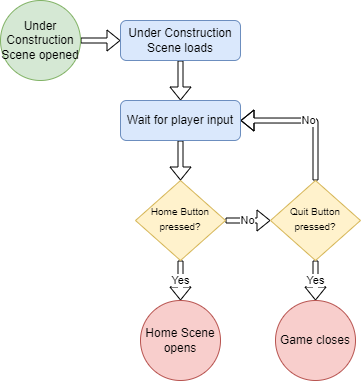

# 
TitlaPong Design Overview

This README is designed to hold information regarding TiltaPong's design. Because the design is image and document heavy, it has been given a separate document to avoid clutter on the main page.

## Table of Contents

1. [Design Document](#DesignDocument)
1. [UI and Behaviour Prototypes](#UIAndBehaviour)
    - [Home Scene](#HomeScene)
    - [Settings Scene](#SettingsScene)
    - [Find Player Scene](#FindPlayerScene)
    - [Gameplay Scene](#GameplayScene)
    - [Gameplay Pause Menu](#GameplayPauseMenu)
    - [Game End Scene](#GameEndScene)
    - [Under Construction Scene](#UnderConstructionScene)

## Design Document

All mechanics and important design decisions are documented in [this document](https://docs.google.com/document/d/1BxIRuREkCNnnhHKFHiHDU0i9Xp5bomv3vNINLLLVrhU/edit?usp=sharing). Anyone is allowed to view and add comments to the document in Google Docs. However, only permitted authors have the security to edit the document. This security helps keep the documented information come from a few sources and can help keep the team informed about all updated decisions. The design document is updated dynamically when important decisions are made during ongoing development. As such, it is not a complete document until the game's development is finished.

## UI and Behaviour Prototypes

Below, wireframes for prototype UI are provides for various screens and menus located within the game. Due to the nature of a wireframe, these do not contain any game art. They are simply used to indicate the placement of different elements visible to the player.

In addition to wireframes, the intended player behaviour is documented using user flow diagrams. The following key can be used to discern the meanings of shapes and colours.
- Green circle - An action initiates the UI
- Blue rectangle - Actions that are descriptive and/or happen automatically
- Yellow diamond - A decision point in the behaviour made by the player or program
- Red circle - An action that ends the behaviour for a given UI and either leads to another UI or closes the game

In the following sections a 'scene' refers to a Unity Scene.

Note: throughout the UI, players are always given a route through which they may quit their current match or the game itself.

##  Home Scene

The Home Scene is the scene the player encounters when launching the game application. The Home Scene is synonymous with 'start screen'.

Wireframe:

User Flow:

##  Settings Scene

The Settings Scene is where players will be able to modify settings outside of gameplay. Here they can change settings involve game behaviour, sounds, and visuals. Game behaviour settings can only be changed from this scene; they cannot be adjusted mid-game.

Wireframe:

User Flow:

##  Find Player Scene

The Find Player Scene is used as an intermediate scene when players are playing against an online opponent. Here, the game will search for an available player until one is found. The player is able to cancel and return to the previous Scene at any time during this process.

Wireframe:

##  Gameplay Scene

The Gameplay Scene is where the actual game takes place. Here players will play TiltaPong against either a computer or online opponent until the win condition is met. The full core gameplay loop is visualised through the corresponding user flow diagram.

Wireframe:

User Flow:

## Gameplay Pause Menu

Pausing the game during gameplay produces a menu that players must interact with. They can close the menu and continue the game, change some aesthetic settings, or quit the current game. The behaviour for pausing a game while a playing an online opponent has not yet been defined.

Wireframe for main pause menu:

Wireframe for the pause menu's settings:

User Flow:

##  Game End Scene

The Game End Scene is entered after a player wins or loses a game of TiltaPong. The text on the screen varies depending on whether the player won or lost their game. From here, users can quit the game, or return to the Home Scene.

Wireframe:

User Flow:

##  Under Construction Scene

The Under Construction Scene is meant to act as a placeholder for scenes that have not been developed yet. The scene's primary purpose is to alert players that a feature is coming, but also give them a way to return to the Home Scene.

Wireframe:

User Flow:

[
Back to Home
](../README.md)
