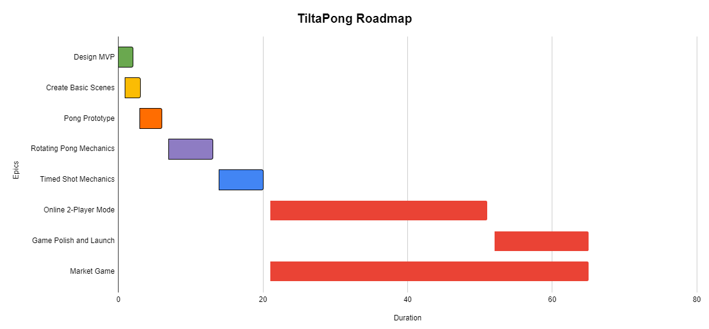
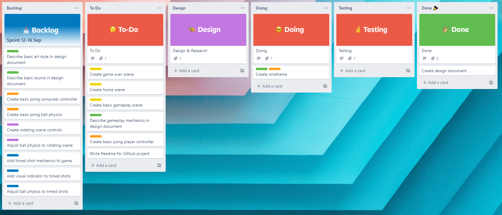
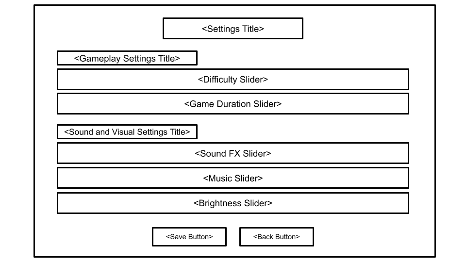
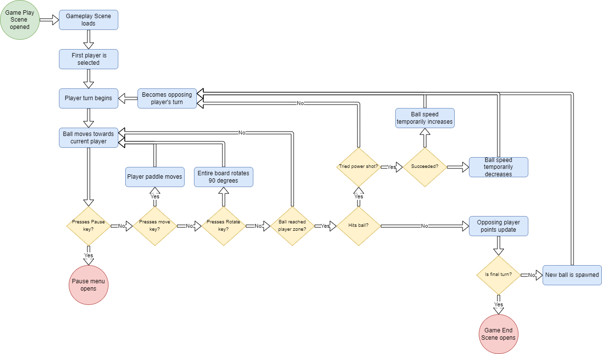
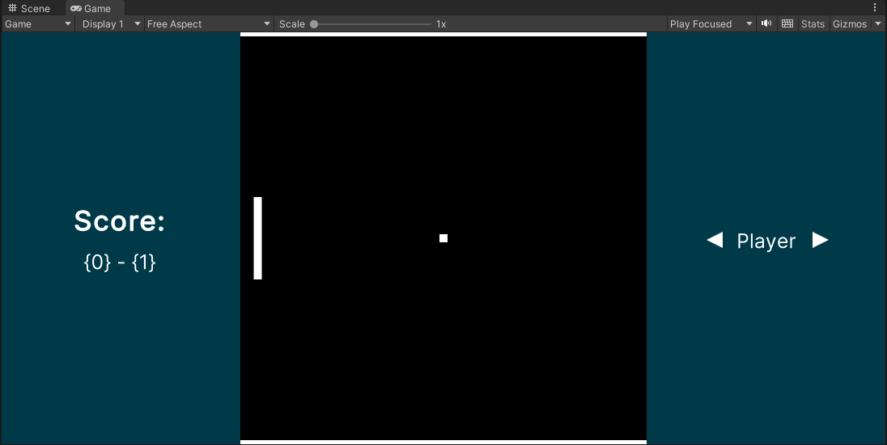

# <p align="center">TiltaPong</p>
<p align="center">A recreation of Pong, but with a couple of 'twists'</p>

## Table of Contents
0. [Before Reading](#BeforeReading)
1. [Project Overview](#ProjectOverview)
1. [Project Planning](#ProjectPlanning)
1. [Design Overview](#DesignOverview)
1. [How to Download and Run](#HowToDownloadAndRun)
    - [Downloading the Project](#DownloadingTheProject)
        - [Using Git + Command Line](#UsingGit)
        - [Using SourceTree](#UsingSourceTree)
    - [Running the Project](#RunningTheProject)
1. [How to Make Changes](#HowToMakeChanges)
    - [Using Git + Command Line](#ChangesUsingGit)
    - [Using SourceTree](#ChangesUsingSourceTree)
    - [Create a Pull Request](#CreatePullRequest)
1. [Tools Overview](#ToolsOverview)

## <a name="BeforeReading"></a> Before Reading

This is a demo project for Popped Corn, a collaborative game development project for the Bristol Game Creators' Club. This paragraph and the [Tools Overview](#ToolsOverview) will be the only time I reference this being a demo project. Everything else will be simulated as if a real project. You may proceed! :)

## <a name="ProjectOverview"></a> Project Overview

Welcome to the TiltaPong repository! TiltaPong is a modern take on the classic arcade game, Pong, but with a couple of unique game mechanics. In addition to the regular back and forth, players will need to incorporate additional strategy with the ability to rotate the entire playing field! Players can also gain an advantage by adding extra power when returning the ball. While the game may feel familiar, new features will create a fun challenge for players. Before facing in-person competitors online, players can enjoy either a more casual experience or intense practice with the built in computer player. Due to its lightweight design and easy controls, TiltaPong is a modern-day arcade game that can be enjoyed by all.

## <a name="ProjectPlanning"></a> Project Planning

TiltaPong is being managed using Agile methodologies, and is utilising a roadmap for important feature development. The [current roadmap](https://docs.google.com/spreadsheets/d/1IkqW6ugz-nVmIMVWQwWdWx6HQyx1fmjXpYGbteyWGx0/edit?usp=sharing) focused on the new core gameplay mechanics:



Each major feature listed in the Roadmap is an Epic that is broken down into smaller tasks and managed using sprints:



Sprints are tracked and managed using [Trello](https://trello.com), and a link to the live [Kanban Taskboard](https://trello.com/invite/b/NYpFjTD3/0ef2224536b68d6acf466df171f4d408/sprint-tasks) is found here (requires a Trello account to view).

## <a name="DesignOverview"></a> Design Overview

The game design for TiltaPong is documented within its [design document](https://docs.google.com/document/d/1BxIRuREkCNnnhHKFHiHDU0i9Xp5bomv3vNINLLLVrhU/edit?usp=sharing). The design document details design decisions for the game, including game mechanics, controls, art direction, etc. The design document is completed dynamically based on the current roadmap. Only designated authors can edit the text of the document, but anyone can add comments. Game design will also be tracked in Google Sheets when identifying configurations of mechanics that are optimal for both fun and challenge.

In addition to the design document, wireframe prototypes and user flow diagrams for the project are presented in [the following document](Design/README.md). In combination, these elements are used as the foundation for the MVP.

Wireframes provide an initial plan for game UI:


User flow diagrams provide an initial plan for player behaviour:


## Game Development Overview

TiltaPong is being developed using Unity and C#, and all code for the project is available under [Assets](Assets/), and is organised based on use case. Scenes were created from each wireframe prototype, and UI was developed using Unity's UI Toolkit. The UI Toolkit provides a method similar to web-application development for creating UI, and was chosen as an experimental comparison to Unity's other UI alternatives (conclusion, it's pretty slick!). We are currently developing the early-version prototype and will provide more technical details in the future:



## Art Overview

Most art for this game will involve pixel art using a single pixel scaled to different sizes. This method be used for the following:
- Both player paddles
- Walls in the game/table area
- Ball

Slightly more sophisticated art will be used for UI/UX, but will still maintain a simple style. Any sprites will be created using Gimp, and both the .xcf and .png files will be source controlled here. All sprites can be found [here](Assets/Sprites).

## Sound Overview

Sound for TiltaPong will primarily come from the Unity Asset Store. Sound effects will be used to indicate both player input and game state. Thematic music will play throughout the game, but will differ depending on the player's scene.

## <a name="HowToDownloadAndRun"></a> How to Download and Run

### <a name="DownloadingTheProject"></a> Downloading the Project

#### <a name="UsingGit"></a> Using Git + Command Line

For this method, you will need to have Git installed on your computer. Git is a free source-control software. If not already installed on your computer, [it can be downloaded here](https://git-scm.com/).

1. Open either PowerShell or a terminal window
1. ```CD``` to the directory you want to store your copy of this project
1. Enter ```git clone https://github.com/zkturman/TiltaPong.git```
    - You may be prompted for credentials at this stage. You can set these properties using a [one-time command](https://git-scm.com/book/en/v2/Getting-Started-First-Time-Git-Setup).
      - ```git config --global user.name "John Doe"```
      - ```git config --global user.email johndoe@example.com```
    - You may also be prompted for GitHub credentials or a personal access token. Following [the steps here](https://docs.github.com/en/authentication/keeping-your-account-and-data-secure/creating-a-personal-access-token) will help you configure Git to prevent continued harassment.
      - Treat this token like a password and keep it CONFIDENTIAL.
      - Git should remember this token once you successfully complete an action using the token and restart the terminal.
1. Enter ```git checkout development```

#### <a name="UsingSourceTree"></a> Using SourceTree

For this method, you will need to have SourceTree installed on your computer. SourceTree is a free Git GUI (as in, you don't need the command line). [It can be downloaded here.](https://www.sourcetreeapp.com/) If you haven't already installed Git, you will need to install it as well. [Git can be downloaded here.](https://git-scm.com/)

1. Open SourceTree
1. Open a new tab and click the 'Clone' button
1. In 'Source Path', enter ```https://github.com/zkturman/TiltaPong.git```
    - Note: this can be copied above by clicking the grey/green Code button and copying the HTTPS URL
1. In 'Destination Path', enter the location on your computer you want this repository to be copied into
1. In 'Name', enter the name you want for your local project folder. E.g., TiltaPong
1. Click 'Advanced options' and change 'Checkout branch' to 'development'
1. Click the 'Clone' button

### <a name="RunningTheProject"></a> Running the Project

To run this project, you will need UnityHub installed on your computer. [It can be downloaded here.](https://unity.com/download) Once downloaded, you will need to download Unity version 2021.3.9f1. To install this version, follow these steps:

1. Open UnityHub
1. Click the 'Installs' tab (on the left)
1. Click the 'Install Editor' button
1. Locate version 2021.3.9.f1 in the 'Official Releases' tab
1. Click the 'Install' button

To open the TiltaPong project:

1. Open UnityHub
1. Click the 'Projects' tab on the left (if not already selected)
1. Click 'Open' >> 'Add Project from Disk'
1. Select your TiltaPong folder
1. Click 'Add Project'
1. If the project does not open automatically, click the TiltaPong row in UnityHub to open the project.

Currently, there are no special run or build instructions. If you would like to run the game from the start, follow these steps:

1. Navigate to the Assets\\Scenes\\ directory within Unity
1. Double click 'HomeScene'
1. Click the Play button at the top of the Unity window

## <a name="HowToMakeChanges"></a> How to Make Changes

After following the instruction in [How to Download and Run](#HowToDownloadAndRun), you can make the desired changes on your machine within your copy of the project.

**NOTE: YOU SHOULD ALWAYS PERFORM A PULL BEFORE MAKING CHANGES TO AVOID CONFLICTS**
- In Git, ```git pull```
- In SourceTree, click the 'Pull' button

Once finished with your changes, you will need to perform some actions to get them onto GitHub (called 'pushing'). Once your changes are 'pushed', you can create a Pull Request as described below. We will then review your changes and add them to the ```main``` branch of source code.

### <a name="ChangesUsingGit"></a> Using Git + Command Line

1. Open either PowerShell or a terminal window
1. ```CD``` to your TiltaPong directory
1. Enter ```git status``` and review all the files you've made changes to.
    - If you have unwanted changes, you can undo all changes to a file using this command: ```git checkout HEAD -- my-file.extension```
1. To prepare these changes for saving, enter ```git add .```, which will add all your local changes.
    - If you would like to add only some changes, replace ```.``` with a filename.
1. To officially save these changes, enter ```git commit -m "COMMIT MESSAGE THAT DESCRIBES YOUR CHANGES"```
1. Finally, enter ```git push``` to send those changes to GitHub.
    - If Git says your local repository is not up to date with remote, you must enter ```git pull``` first. This command will update your local files with all new changes to the repository. If this creates merge conflicts, you will need to fix them and redo these steps. See [here](https://docs.github.com/en/pull-requests/collaborating-with-pull-requests/addressing-merge-conflicts/about-merge-conflicts) for help. There are other strategies for handling this scenario, but approach with caution.
1. [Create a Pull Request](#CreatePullRequest)

### <a name="ChangesUsingSourceTree"></a> Using SourceTree

1. Open SourceTree
1. Open your TiltaPong tab/repository
1. Click the 'Commit' button and add a message that describes your changes
1. Click the 'Stage All' button, or select certain files and click the 'Stage Selected' button
1. Tick the 'Push changes immediately to <BRANCHNAME>' checkbox
1. Click the 'Commit' button
    - If your repository is out of date, you may need to click the 'Pull' button first. If this creates merge conflicts, you will need to fix them and redo these steps. See [here](https://docs.github.com/en/pull-requests/collaborating-with-pull-requests/addressing-merge-conflicts/about-merge-conflicts) for help.
1. [Create a Pull Request](#CreatePullRequest)

### <a name="CreatePullRequest"></a> Create a Pull Request

In GitHub, click the 'Pull requests' tab above, or [this link](https://github.com/zkturman/TiltaPong/pulls). If your changes are recent, you may see a banner stating so, and you can follow these steps:
1. Click the 'Compare & pull request' button
1. Scroll down to review the changes are yours
1. Add a brief comment describing your changes
1. Click the 'Create pull request' button
1. On the right, under the Reviewers section, add someone and contact them letting you know you've created a pull request.
1. Someone will review and (hopefully) add your changes to ```main```

If you do not see a banner concerning your changes, follow these steps:
1. Click the 'Pull requests' tab at the top of the screen
1. Click the 'New pull request' button
1. Click the branch with your changes (usually ```development```)
1. Review the changes to make sure they're your changes
1. Click the 'Create pull request' button
1. Add a brief comment describing your changes
1. Click the 'Create pull request' button
1. On the right, under the Reviewers section, add someone and contact them letting you know you've created a pull request.
1. Someone will review and (hopefully) add your changes to ```main```

## <a name="ToolsOverview"></a> Tools Overview

Below are all free tools that can be used for game development when working on Popped Corn projects. Other tools can be used as well, even paid tools. However, any content should always be stored in a way that allows others to access it for free.

- [Google Sheets](https://docs.google.com/spreadsheets) - Shareable roadmap creation and game mechanic logging
- [Trello](https://trello.com) - Sprint task tracking and sharing
- [Google Docs](https://docs.google.com) - Design document creation and sharing
- [Google Slides](https://docs.google.com/presentation) - Wireframe creation and sharing
- [diagrams.net](https://www.diagrams.net/) - Web-based diagram creation tools (can save directly to GitHub)
- [Git](https://git-scm.com/) - Free version control software
- [GitHub](https://github.com/) - Free hosted remote repositories for version control (as well as other things)
- [Unity](https://unity.com/) - Game engine and development tool primarily using C#
- [Unreal](https://www.unrealengine.com/en-US/) - Game engine and development tool primarily using Blueprints and C++
- [Godot](https://godotengine.org/) - Open-source game engine that uses its own language (GDScript), C#, or C++
- [Gimp](https://www.gimp.org/) - Free image editing software (includes more advanced tools than Paint, like layers and custom brushes)
- [Blender](https://www.blender.org/) - Free 3D modelling and animation software
- [Audacity](https://www.audacityteam.org/) - Free audio recording and editing
- [Cakewalk](http://www.cakewalk.com/) - Free audio recording, creation, and editing
